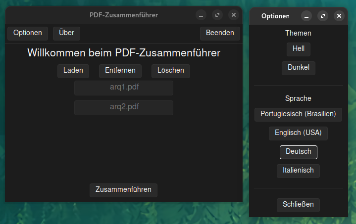

# Juntador de PDFs

O objetido do projeto atual é criar uma ferramenta open-source usando Python e Tkinter onde seja possível unir dois ou mais PDFs em um arquivo.

<p align="center">
  
</p>
<p align="center">
  
</p>

## sobre o projeto

Ele usa o [Python](https://www.python.org/) e a interface gráfica [tkinter](https://docs.python.org/3/library/tkinter.html) para criar a interface e tornar a fusão dos PDFs possíveis.

Pacotes externos :
- [PyPDF2](https://pypi.org/project/PyPDF2/) para realizar a fusão dos arquivos;
- [pyinstaller](https://pypi.org/project/pyinstaller/) para criar o executável;
- [Pillow](https://pypi.org/project/pillow/) para exibir as imagens;
- [py-window-styles](https://pypi.org/project/pywinstyles/) para barra de tarefas do Windows;

Temas :
- [Sum Valley](https://pypi.org/project/sv-ttk/) para tema claro ou escuro;
- mais temas estão vindo...

## preparação

Abaixo há a realação de comandos necessários para criar um ambiente virtual, ativá-lo e instalar as dependências.

### linux e macos

```bash
pdf_merge❯ python -m venv .venv
pdf_merge❯ source .venv/bin/activate
pdf_merge❯ pip install -r requisitos.txt
```

### windows

```powershell
pdf_merge❯ python -m venv .venv
pdf_merge❯ .venv\Scripts\activate
pdf_merge❯ pip install -r requisitos.txt
```

Para executar, basta digitar no terminal / prompt de comando :

```bash
pdf_merge❯ python main.py
```

## build

Para criar o executável, é preciso executar o `pyinstaller` a partir do Terminal/Prompt de Comando. Isso vai criar um executável que pode ser distribuído.

### linux

```bash
❯ pyinstaller --onefile --add-data "assets/cpd-logo.jpg:assets" --add-data "themes/sv_ttk:themes/sv_ttk" --hidden-import="PIL._tkinter_finder" --noconsole main.py
```

### windows

```powershell
❯ pyinstaller --onefile --icon "assets/ufrgs.ico" --add-data "assets/cpd-logo.jpg;assets" --add-data "themes/sv_ttk;themes/sv_ttk" --add-data "assets/ufrgs.ico;assets" --hidden-import="PIL._tkinter_finder" --noconsole main.py
```

## todo

- [ ] adicionar remoção individual do frame (atualmente funciona com FILO);
- [ ] persistir alterações como tema e idioma;
- [ ] adicionar idioma espanhol;
- [x] adicionar mais idiomas (italiano e alemão);
- [x] arrumar o tema das janelas (está apenas no widgets);

## versões

- `v1.2.4` : anotações foram adicionadas;
- `v1.2.3` : melhor comentários e organização do código;
- `v1.2.2` : ajustes para o executável;
- `v1.2.1` : adicionado tema manualmente por conta de alguns ajustes específicos;
- `v1.2.0` : removido o menu da barra de tarefas e movido para os botões, adicionado idiomas alemão e italiano;
- `v1.1.1` : ajuste no import do pywinstyles;
- `v1.1.0` : ajustado para apenas dois temas *claro* (padrão) e *escuro*;
- `v1.0.4` : fundo da janela principal agora muda de acordo com o tema;
- `v1.0.3` : ajustes diversos e melhor organização;
- `v1.0.2` : ajustes diversos;
- `v1.0.1` : ajustes diversos;
- `v1.0.0` : lançada a primeira versão para Windows e Linux;
