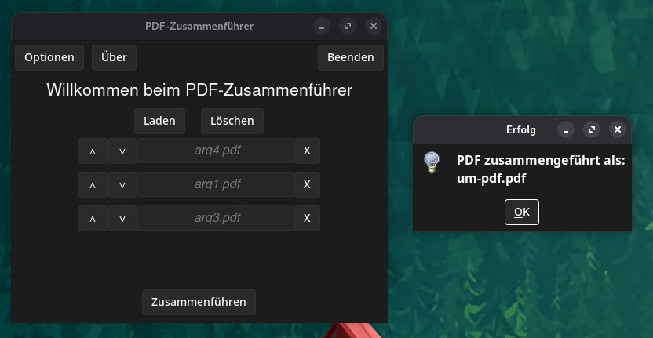

# Juntador de PDFs

O Juntador de PDFs é uma ferramenta desenvolvida para que seja possível juntar, unir, agrupar Portable Document Format (PDF) em um documento.

Essa solução foi pensada visando a privacidade e praticidade.

Soluções online não são confiáveis porque não há como saber se uma cópia dos documentos será mantida e distribuída online.
Soluções através de aplicativos instalados também oferecem risco pois muitos deles podem ser programas maliciosos ou programas espiões.

Então o projeto atual foi criado de forma [open-source](https://pt.wikipedia.org/wiki/C%C3%B3digo_aberto) usando Python e Tkinter.

<details>
<summary>Capturas de Tela</summary>

<p align="center">Selecionando Diversos Arquivos</p>
<p align="center">
  
</p>
<p align="center">Aviso de Arquivo(s) Corrompido(s)</p>
<p align="center">
  
</p>
<p align="center">Arquivos Reordenados</p>
<p align="center">
  
</p>
<p align="center">Janela de Opções (Tema e Idioma)</p>
<p align="center">
  
</p>
<p align="center">Janela de Sobre</p>
<p align="center">
  
</p>
<p align="center">Janela Aberta ao Salvar</p>
<p align="center">
  
</p>
<p align="center">Aviso de Arquivo Salvo com Sucesso</p>
<p align="center">
  
</p>

</details>

## como usar o programa

Acesse a página de [Download do Juntador de PDFs](https://github.com/ufrgs/pdf_merge/releases) e baixe a versão específica de seu sistema operacional.

Use o botão *Carregar* para abrir a janela e selecionar um ou mais arquivos.
Eles irão aparecer em uma lista dentro da janela pricipal. Ao lado de cada PDF carregado haverá 3 botões :
- `X` : para remover aquele PDF em específico;
- `∧` : para mover o PDF para cima;
- `∨` : para mover o PDF para baixo;

Quando usar o botão *Juntar*, um novo PDF será criado seguindo a ordem dos documentos na janela principal.

## sobre o projeto

Ele usa o [Python](https://www.python.org/) e a interface gráfica [tkinter](https://docs.python.org/3/library/tkinter.html) para tornar a fusão dos PDFs possível.

Pacotes externos :
- [PyPDF2](https://pypi.org/project/PyPDF2/) realiza a fusão dos arquivos PDFs;
- [pyinstaller](https://pypi.org/project/pyinstaller/) cria o executável;
- [Pillow](https://pypi.org/project/pillow/) exibe as imagens;
- [py-window-styles](https://pypi.org/project/pywinstyles/) barra de tarefas do Windows;

Tema :
- [Sun Valley](https://pypi.org/project/sv-ttk/) usado para tema claro ou escuro;

## preparação

Abaixo há a realação de comandos necessários para criar um ambiente virtual, ativá-lo e instalar as dependências.

### linux e macos

```bash
pdf_merge❯ python -m venv .venv
pdf_merge❯ source .venv/bin/activate
pdf_merge❯ pip install -r requisitos.txt
```

### windows

```powershell
pdf_merge❯ python -m venv .venv
pdf_merge❯ .venv\Scripts\activate
pdf_merge❯ pip install -r requisitos.txt
```

Para executar, basta digitar no terminal / prompt de comando :

```bash
pdf_merge❯ python -m pdf_merge.main
```

## build

Para criar o executável, é preciso executar o `pyinstaller` a partir do Terminal/Prompt de Comando. Isso vai criar um executável que pode ser distribuído.

### linux

```bash
❯ pyinstaller --onefile \
    --add-data "pdf_merge/assets/cpd-logo.jpg:assets" \
    --add-data ".venv/lib/python3.13/site-packages/sv_ttk:sv_ttk" \
    --hidden-import="PIL._tkinter_finder" \
    --noconsole \
    pdf_merge/main.py
```

### windows

```powershell
❯ pyinstaller --onefile `
    --icon "pdf_merge/assets/ufrgs.ico" `
    --add-data "pdf_merge/assets/ufrgs.ico;pdf_merge/assets" `
    --add-data "pdf_merge/assets/cpd-logo.jpg;pdf_merge/assets" `
    --add-data ".venv/Lib/site-packages/sv_ttk;sv_ttk" `
    --hidden-import="PIL._tkinter_finder" `
    --noconsole `
     pdf_merge/main.py
```

## todo

- [ ] persistir alterações como tema e idioma;
- [x] adicionar remoção individual do frame (atualmente funciona com FILO);
- [x] adicionar idioma espanhol;
- [x] adicionar mais idiomas (italiano e alemão);
- [x] arrumar o tema das janelas (está apenas no widgets);

## versões

- `v1.3.0` : PDFs podem ser reorganizados;
- `v1.2.6` : verificação de PDFs corrompidos e organização;
- `v1.2.5` : adicionado idioma espanho e removido o \_\_init\_\_.py;

<details>
<summary>mais antigas</summary>

- `v1.2.4` : anotações foram adicionadas;
- `v1.2.3` : melhor comentários e organização do código;
- `v1.2.2` : ajustes para o executável;
- `v1.2.1` : adicionado tema manualmente por conta de alguns ajustes específicos;
- `v1.2.0` : removido o menu da barra de tarefas e movido para os botões, adicionado idiomas alemão e italiano;
- `v1.1.1` : ajuste no import do pywinstyles;
- `v1.1.0` : ajustado para apenas dois temas *claro* (padrão) e *escuro*;
- `v1.0.4` : fundo da janela principal agora muda de acordo com o tema;
- `v1.0.3` : ajustes diversos e melhor organização;
- `v1.0.2` : ajustes diversos;
- `v1.0.1` : ajustes diversos;
- `v1.0.0` : lançada a primeira versão para Windows e Linux;

</details>

